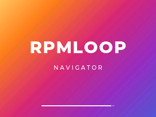
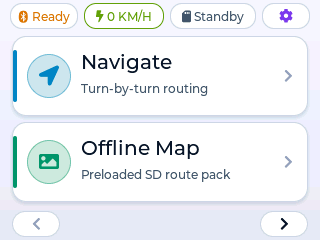
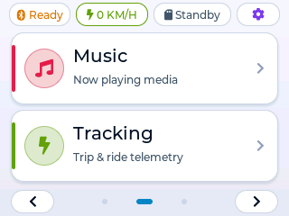
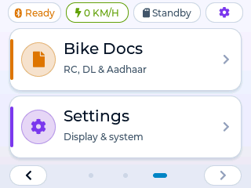
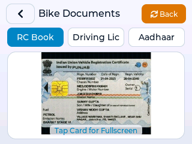
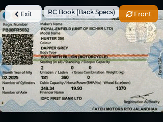
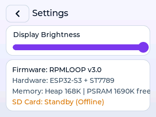

# RPMLOOP Navigator v3.0

An open-source, motorcycle handlebar cockpit navigator engineered for the **Royal Enfield Hunter 350**, powered by an **ESP32-S3**, **2.8" ST7789V display**, **LVGL 8.3.11**, and **LovyanGFX**.



---

## 🌟 Overview

**RPMLOOP Navigator** provides riders with real-time turn-by-turn guidance, telemetry tracking, media playback control, and a digital vehicle document vault (RC, Driving License & Aadhaar Card) directly on the handlebars.

### Key Capabilities
- **Paged Ergonomic Dashboard:** 2 large (296×84px), high-contrast cards per page across 3 pages. Seamless button `<` / `>` and dot pagination tailored for motorcycle gloves.
- **Modern Light Slate Visual Theme:** Clean, crisp daylight visibility with vibrant per-feature accent rails.
- **Dynamic Splash Screen:** 45-degree animated Instagram gradient with bold Montserrat typography and progress shimmer.
- **Digital Bike Documents Hub:** Quick-access vehicle documents vault with instant **Tap-to-Fullscreen 1:1 view** and Front/Back flipping for smooth roadside inspections.
- **Production BLE Protocol:** Autonomous NimBLE GATT server advertising as `RPMLOOP`. All telemetry, navigation, and media contracts strictly defined.
- **Offline Map Architecture:** SD-card preloaded route tiles engine for offline rendering independent of cellular reception.

---

## 📸 UI Showcase

| Animated Splash Screen | Home — Page 1 (Nav & Map) |
| :---: | :---: |
|  |  |

| Home — Page 2 (Music & Tracking) | Home — Page 3 (Docs & Settings) |
| :---: | :---: |
|  |  |

| Bike Documents Hub | Fullscreen RC Book (Hunter 350) |
| :---: | :---: |
|  |  |

| RC Book (Back Side) | Aadhaar Card Fullscreen |
| :---: | :---: |
|  |  |

| System Settings | Hunter 350 Custom Enclosure |
| :---: | :---: |
|  | *Available in [`printing_files/`](printing_files/)* |

---

## ⚡ Hardware Specifications

| Component | Specification |
|---|---|
| **Microcontroller** | ESP32-S3 Mini / DevKit (Dual-Core 240 MHz, 4 MB Flash, 2 MB PSRAM) |
| **Display Panel** | 2.8" SPI TFT LCD (ST7789V driver, 320×240 landscape, 16 MHz SPI) |
| **Touch Controller** | HR2046 / XPT2046 resistive touch on dedicated `SPI3_HOST` |
| **Storage** | External MicroSD SPI module (FAT32 filesystem, offline tiles store) |
| **Wireless** | Bluetooth Low Energy 5.0 (NimBLE stack) |

### Pinout Mapping

```
ESP32-S3 Mini Pinout
├── Display (SPI2_HOST)
│   ├── SCK  ────── GPIO 6
│   ├── MOSI ────── GPIO 7
│   ├── MISO ────── GPIO 8
│   ├── CS   ────── GPIO 9
│   ├── DC   ────── GPIO 10
│   └── RST  ────── GPIO 11
├── MicroSD Card (Shared SPI2_HOST)
│   ├── SCK  ────── GPIO 6
│   ├── MOSI ────── GPIO 7
│   ├── MISO ────── GPIO 8
│   └── CS   ────── GPIO 13
└── Touch Controller (SPI3_HOST)
    ├── CLK  ────── GPIO 1
    ├── DIN  ────── GPIO 2
    ├── DO   ────── GPIO 3
    ├── IRQ  ────── GPIO 4
    └── CS   ────── GPIO 5
```

---

## 📡 BLE Protocol Specification

The device operates an autonomous BLE GATT server advertising as **`RPMLOOP`**. The companion mobile app communicates using standardized JSON payloads defined in [`firmware/protocol/protocol_spec.json`](firmware/protocol/protocol_spec.json).

### Primary Services & Characteristics

| Characteristic | UUID | Direction | Purpose |
|---|---|---|---|
| **Nav Update** | `c2a10001-0001-1000-8000-00805f9b34fb` | App → Device | Maneuver icon, distance, road name, ETA |
| **Position Update** | `c2a10002-0001-1000-8000-00805f9b34fb` | App → Device | Current latitude, longitude, heading, speed |
| **Media State** | `c2a10003-0001-1000-8000-00805f9b34fb` | Both | Track title, artist, playback state, track skipping |
| **Device Status** | `c2a10004-0001-1000-8000-00805f9b34fb` | Device → App | Battery level, satellite count, storage health |

---

## 🛠️ Building & Flashing

### Requirements
- [PlatformIO Core](https://platformio.org/) or VS Code with PlatformIO IDE extension.
- ESP32-S3 connected via native USB (`COM3` on Windows / `/dev/ttyACM0` on Linux).

### Build Firmware
```bash
cd firmware
pio run
```

### Flash Firmware
```bash
cd firmware
pio run -t upload
```

### Monitor Serial Logs
```bash
pio device monitor -b 115200
```

---

## 🏍️ 3D Printable Enclosure

The complete 3D printable handlebar mount and weather-resistant enclosure tailored specifically for the **Royal Enfield Hunter 350** triple-clamp and handlebar assembly is located in the [`printing_files/`](printing_files/) directory:
- Front Bezel with screen protector recess
- Main Body housing ESP32-S3, display, and SD module
- Handlebar bracket with anti-vibration rubber damper slots

---

## 📄 License

This project is licensed under the MIT License — see the [LICENSE](LICENSE) file for details.
